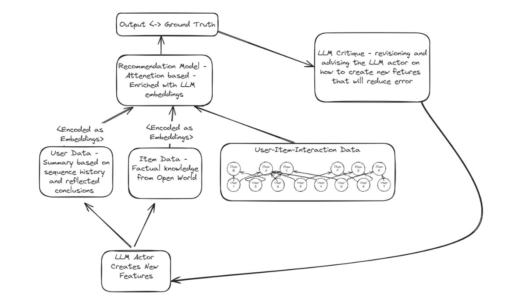

# RefRec - LLM-Assisted Recommendation System with Self-Reflection

##  Abstract
LLMs are driving forward the recommendation system domain with new capabilities. Self-reflection is a method that recently outperformed various methods like few-shot or chain-of-thought methods. This is an attempt to utilize this method in order to improve recommendation systems that are assisted with LLMs.
Based and extending the work in Towards Open-World Recommendation with Knowledge Augmentation from Large Language Models

## Problem Description
When coupling LLMs with recommendation systems, the output of the LLM model is typically the first shot of a user profile generation or item description - this probably yields a sub-optimal solution.
Using self-reflection, we can refine the LLMs' output in respect to the model output. In that manner, we could utilize the processing power and complexity of the LLM better and keep the recommendation system still efficient.

## Proposed Solution Method
I have extended the work of [Towards Open-World Recommendation with Knowledge Augmentation from Large Language Models (KAR)](https://github.com/YunjiaXi/Open-World-Knowledge-Augmented-Recommendation) and its open-source code.
The paper introduces a model-agnostic framework that bridges between recommender systems and the capabilities of LLMs like open-world knowledge and reasoning.

